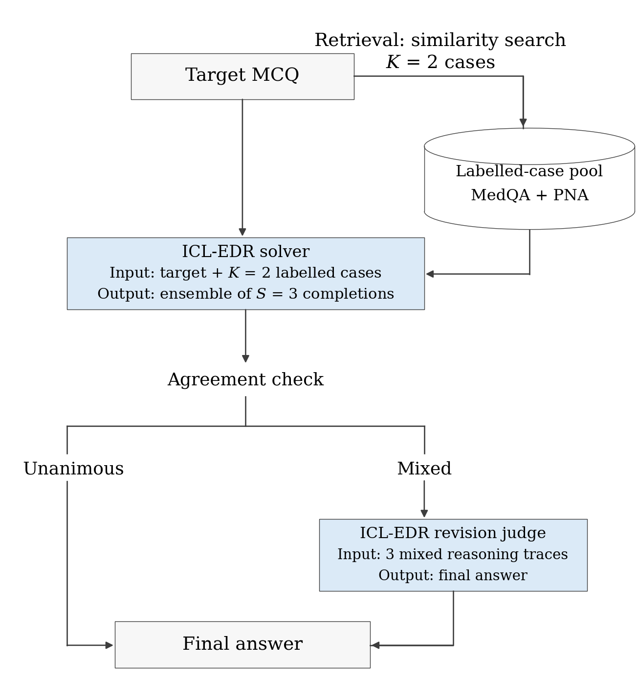
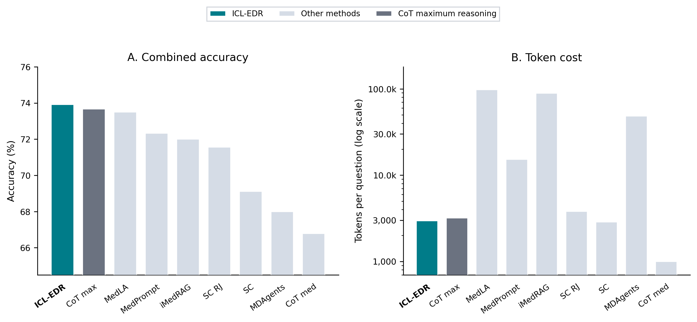
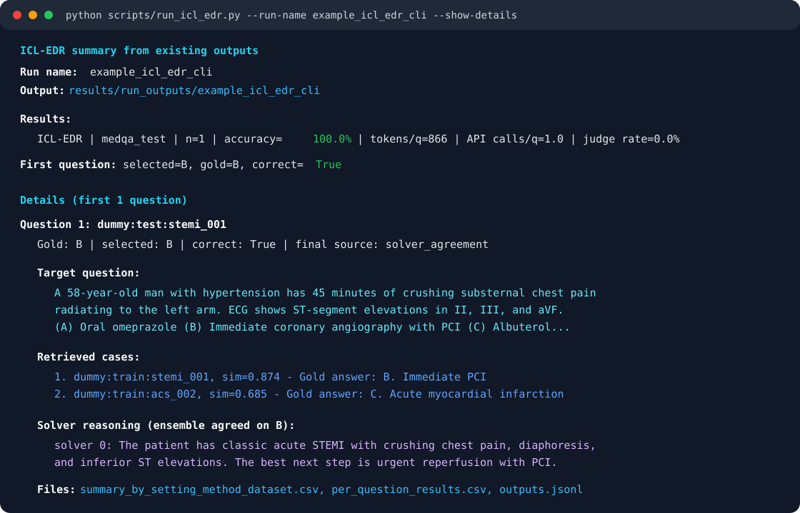

# Efficient Test-Time Scaling for Medical Reasoning

**Implicit Case-Learning Ensemble with Disagreement-Routed Revision (ICL-EDR).**

This clean release accompanies the thesis experiments on **Implicit Case-Learning Ensemble with Disagreement-Routed Revision (ICL-EDR)**. ICL-EDR is a compact test-time scaling method for medical multiple-choice question (MCQ) reasoning: it retrieves target-similar labelled cases without generated source rationales, generates a small solver ensemble, and routes mixed ensembles to a revision judge.

The selected ICL-EDR workflow retrieves two similar answer-labelled cases, generates a three-completion solver ensemble, and routes only mixed ensembles to a revision judge.



The main experiments evaluate ICL-EDR on balanced-difficulty MedQA and Portuguese National Residency Access Examination ([PNA; official ACSS page](https://www.acss.min-saude.pt/category/profissionais/carreiras/medica/internatomedico/prova-nacional-de-acesso/)) panels using GPT-5.4-nano with medium reasoning effort. The method is compared with general test-time scaling baselines (CoT, Self Consistency, and Self-Consistency Routed Judge), medical-specific baselines ([MedPrompt](https://arxiv.org/abs/2311.16452), [MDAgents](https://arxiv.org/abs/2404.15155), [MedLA](https://ojs.aaai.org/index.php/AAAI/article/view/37052), and [iMedRAG](https://doi.org/10.1142/9789819807024_0015)), and the same model run with maximum reasoning effort. The routed-judge self-consistency baseline follows the [EnsReas](https://academic.oup.com/jamia/article/31/9/1964/7705627) setup.

## Main Interpretation

ICL-EDR achieved the highest combined accuracy point estimate on the MedQA+PNA panel, with a bootstrap-significant gain over medium-reasoning CoT. It was not clearly separated, however, from the strongest alternative baselines or from maximum-reasoning CoT. On PNA, ICL-EDR and MedPrompt were the only methods with bootstrap-significant gains over the CoT baseline.

The main efficiency result is that ICL-EDR reaches this accuracy at a token cost comparable to maximum-reasoning CoT and self-consistency baselines. It uses about 3x the token cost of medium-reasoning CoT, has similar combined accuracy to maximum-reasoning CoT, and uses substantially fewer tokens than higher-budget medical-specific TTS baselines such as MedPrompt, MDAgents, iMedRAG, and MedLA.



<sub>Figure note: SC = Self-Consistency; SC RJ = Self-Consistency with Routed Judge. All TTS methods use GPT-5.4-nano with medium reasoning effort; CoT max uses the same model with xhigh reasoning effort.</sub>

Ablations identified disagreement-routed revision as the clearest contributor. Implicit raw-labelled cases had a higher combined point estimate than generated-rationale cases while avoiding rationale-generation calls. Robustness checks across open and closed model families showed that ICL-EDR improved MedQA accuracy in all tested settings and PNA accuracy in most tested settings.

Overall, the results support ICL-EDR as a lower-cost medical TTS design that can improve medical MCQ reasoning without relying only on high-budget retrieval or multi-agent pipelines.

## Folder Layout

- `src/`
  - Minimal executable code for ICL-EDR, prompt builders, and schemas.

- `notebooks/`
  - Minimal example notebook showing how to build dummy retrieval data and run ICL-EDR.

- `scripts/`
  - Command-line launcher for building retrieval data and running ICL-EDR.

- `example_data/`
  - Tiny synthetic target/source MCQs for trying the notebook without restricted thesis data. The notebook builds the dummy retrieval JSON from these CSVs.

- `figures/`
  - Rendered PNG figures used in this README.

- `results/figure_data/`
  - Compact CSV files behind the README figures, kept so the plotted values are traceable.

- `results/panel150_predictions_no_text/`
  - Public-safe per-question outcome tables for auditing the main panel-150 accuracy values.

- `data/`
  - Public-safe panel metadata without full question text.

## Implementation Guide

### Environment and API Keys

Create an environment and install the runtime dependencies:

```bash
python -m venv .venv
source .venv/bin/activate
pip install -r requirements.txt
cp .env.example .env
```

Then edit `.env` with your local API keys. The real `.env` file is ignored by git.

`OPENAI_API_KEY` is required for the default OpenAI model calls and for building retrieval data with OpenAI embeddings. `HF_TOKEN` is only needed if you use Hugging Face Inference Providers.

### Preparing Input Data

The release includes tiny synthetic inputs in `example_data/`:

- `dummy_target_question.csv`: one synthetic medical MCQ target question.
- `dummy_source_cases.csv`: four synthetic labelled source cases.

For your own evaluation set, provide a target-question CSV and either a prepared retrieval JSON or a labelled source-case CSV from which the retrieval JSON can be built. The target-question CSV should include question text/options, a question key, valid option letters, and the gold answer. The source-case CSV should include source question text/options, source keys, and gold answers.

You can set paths with environment variables:

```bash
ICL_EDR_TARGET_CSV=/path/to/target_questions.csv
ICL_EDR_RETRIEVAL_JSON=/path/to/retrieval_cases.json
ICL_EDR_SOURCE_CSV=/path/to/source_cases.csv
```

or pass the same paths directly to the CLI with `--target-csv`, `--retrieval-json`, and `--source-csv`.

### Building Similar-Case Retrieval

ICL-EDR expects a retrieval JSON that maps each target question to its nearest labelled source cases. To build it for the synthetic example:

```bash
python scripts/run_icl_edr.py --build-retrieval
```

This creates a local `example_data/dummy_retrieval.json` and then performs a dry run. Add `--run-api` if you also want to execute the ICL-EDR model calls.

For your own data:

```bash
python scripts/run_icl_edr.py \
  --build-retrieval \
  --target-csv /path/to/target_questions.csv \
  --source-csv /path/to/source_cases.csv \
  --retrieval-json /path/to/retrieval_cases.json
```

### Running ICL-EDR

#### Notebook Implementation

Open `notebooks/run_icl_edr_example.ipynb` for a runnable walkthrough. The notebook uses the synthetic data, builds a local `dummy_retrieval.json`, runs ICL-EDR on one target question, and includes an optional section for the matched CoT baseline. Set `RUN_API = False` for a dry run.

Run the notebook with the same Python environment where `requirements.txt` was installed.

#### CLI Implementation

After the retrieval JSON exists, dry run with the default synthetic files:

```bash
python scripts/run_icl_edr.py
```

Run ICL-EDR provider calls:

```bash
python scripts/run_icl_edr.py --run-api --run-name example_icl_edr_cli
```

Show the full target question, retrieved cases, selected answer, gold answer, and solver/judge reasoning from an existing or completed run:

```bash
python scripts/run_icl_edr.py --run-name example_icl_edr_cli --show-details
```

The terminal output uses color to separate the target question, retrieved cases, solver reasoning, and file paths:



Run ICL-EDR plus the matched CoT baseline:

```bash
python scripts/run_icl_edr.py \
  --run-api \
  --include-cot-baseline \
  --run-name example_icl_edr_with_cot_cli
```

Run on your own evaluation set:

```bash
python scripts/run_icl_edr.py \
  --target-csv /path/to/target_questions.csv \
  --retrieval-json /path/to/retrieval_cases.json \
  --run-api
```

Outputs are written under `results/run_outputs/<run-name>/`. The core implementation is in `src/icl_edr_runner.py`, with prompt construction in `src/prompts.py`.

Common CLI options:

| Option | Values / default | Purpose |
|---|---|---|
| `--build-retrieval` | flag, default off | Build the retrieval JSON before running ICL-EDR. |
| `--run-api` | flag, default off | Execute provider calls; without it, the CLI performs a dry run. |
| `--include-cot-baseline` | flag, default off | Also run the matched CoT baseline. |
| `--run-name` | string, default `cli_icl_edr_run` | Output subdirectory name under `results/run_outputs/`. |
| `--target-csv` | path, default `example_data/dummy_target_question.csv` | Target questions to answer. |
| `--source-csv` | path, default `example_data/dummy_source_cases.csv` | Labelled source cases used when building retrieval. |
| `--retrieval-json` | path, default `example_data/dummy_retrieval.json` | Retrieval mapping consumed by ICL-EDR. |
| `--provider` | `openai` or `huggingface_inference_providers`; default `openai` | Provider branch. |
| `--model` | model ID; default `$OPENAI_MODEL` or `gpt-5.4-mini` | Model used for solver and judge calls. |
| `--reasoning-effort` | string; default `$OPENAI_REASONING_EFFORT` or `medium` | Reasoning effort passed to OpenAI-style calls. |
| `--retrieval-k` | integer, default `2` | Number of similar cases shown to ICL-EDR. |
| `--solver-count` | integer, default `3` | Number of solver completions in the ICL-EDR ensemble. |
| `--workers` | integer, default `8` | Parallel task workers. |
| `--max-tasks` | integer, default `20`; `0` means no cap | Safety cap for tasks in one run. |
| `--force-rerun` | flag, default off | Ignore existing successful outputs and rerun tasks. |
| `--show-details` | flag, default off | Print full target question, retrieved cases, selected/gold answers, and solver/judge reasoning for a small number of completed rows. |
| `--show-details-limit` | integer, default `1` | Number of completed rows shown when `--show-details` is used. |
| `--no-color` | flag, default off | Disable ANSI color in the final CLI summary. |
| `--verbose-runner-output` | flag, default off | Show the lower-level runner progress and pandas summary output. |

For all options:

```bash
python scripts/run_icl_edr.py --help
```
